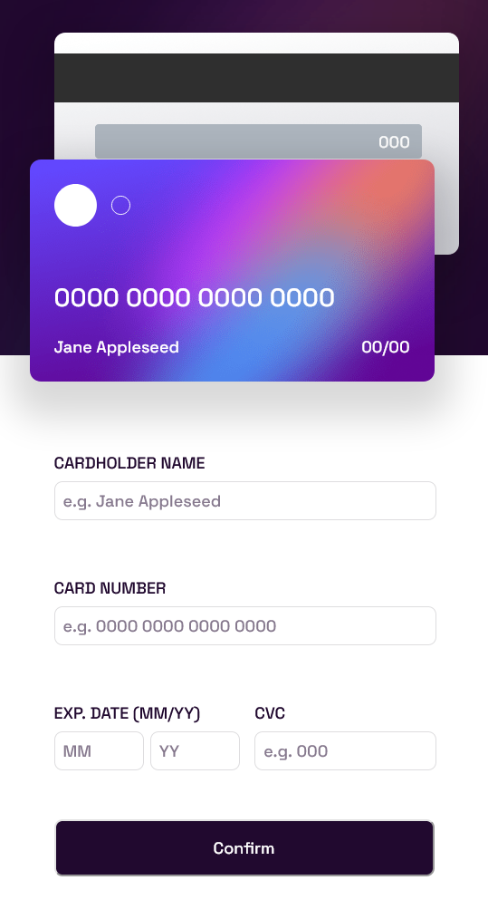
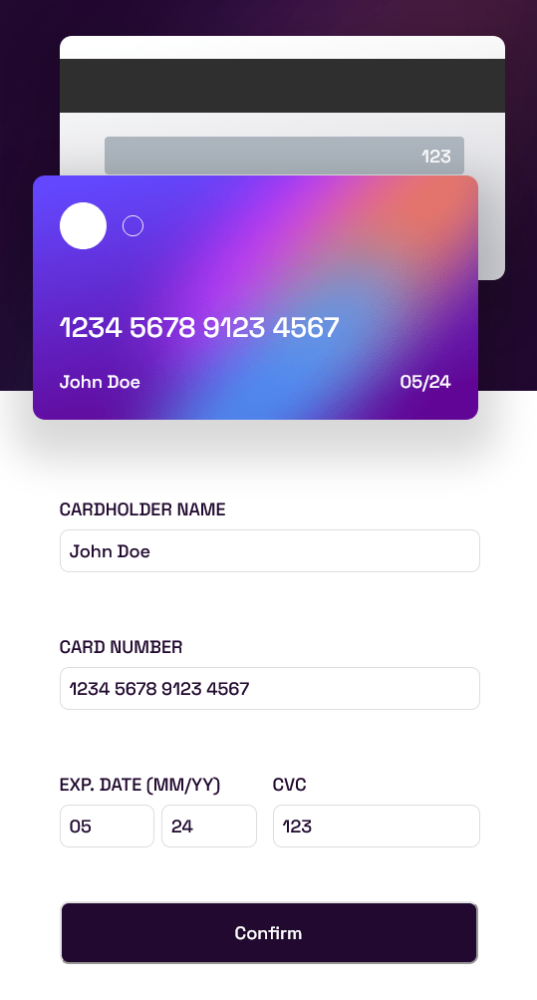
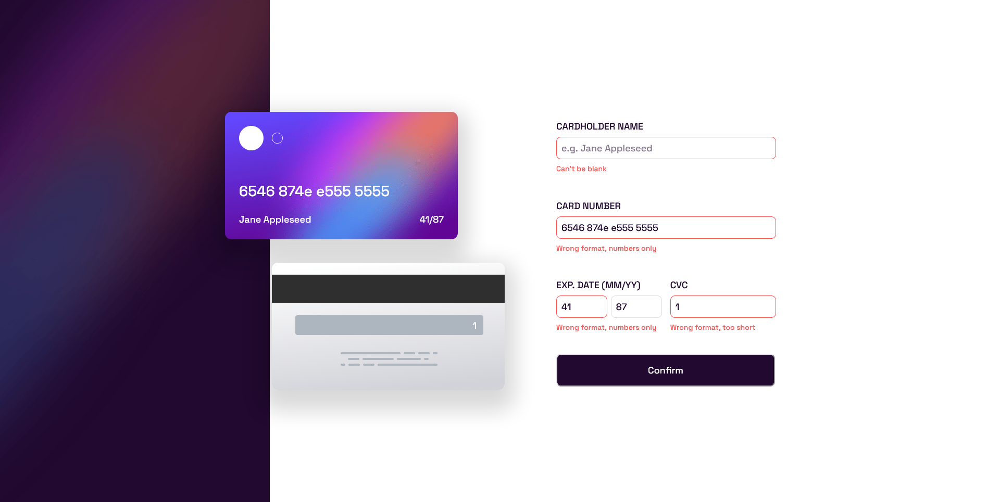

# Frontend Mentor - Interactive card details form solution

This is a solution to the [Interactive card details form challenge on Frontend Mentor](https://www.frontendmentor.io/challenges/interactive-card-details-form-XpS8cKZDWw). Frontend Mentor challenges help you improve your coding skills by building realistic projects.

## Table of contents

- [Overview](#overview)
  - [The challenge](#the-challenge)
  - [Screenshot](#screenshot)
  - [Links](#links)
- [My process](#my-process)
  - [Built with](#built-with)
  - [What I learned](#what-i-learned)
- [Author](#author)

## Overview

### The challenge

Users should be able to:

- Fill in the form and see the card details update in real-time
- Receive error messages when the form is submitted if:
  - Any input field is empty
  - The card number, expiry date, or CVC fields are in the wrong format
- View the optimal layout depending on their device's screen size
- See hover, active, and focus states for interactive elements on the page

### Screenshot






### Links

- Solution URL: [Add solution URL here](https://your-solution-url.com)
- Live Site URL: [Add live site URL here](https://your-live-site-url.com)

## My process

### Built with

- CSS custom properties
- Flexbox
- CSS Grid
- [React](https://reactjs.org/) - JS library

### What I learned

This was a opportunity to dip my toes into react state management. While writing this I see where else in this project I can implement it, so I will probably refactor this at a later date. This is also my first project using typescript.

I'm quite happy with how the project is broken down into components

```tsx
const CardFront = ({
  cardName,
  cardNumber,
  cardMonth,
  cardYear,
}: CardFrontInterface) => {
  return (
    <div className={style.Card}>
      <div className={style.Content}>
        <div className={style.Logo}></div>
        <div id="card-number" className={style.Number}>
          {cardNumber}
        </div>
        <div id="card-name" className={style.Name}>
          {cardName}
        </div>
        <div className={style.Date}>
          <span id="card-month">{cardMonth}</span>/
          <span id="card-year">{cardYear}</span>
        </div>
      </div>
    </div>
  );
};
export default CardFront;
```

## Author

- Website - [Haakon Mydland](https://www.haakonmydland.com/home)
- Frontend Mentor - [@haakonmydland](https://www.frontendmentor.io/profile/haakonmydland)
- Twitter - [@haakonmydland](https://www.twitter.com/haakonmydland)
